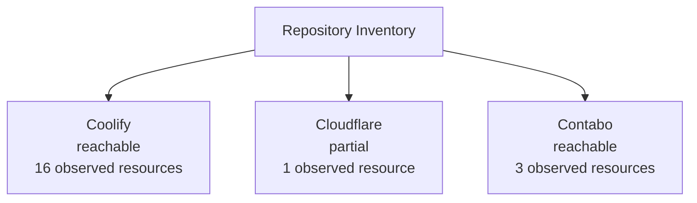
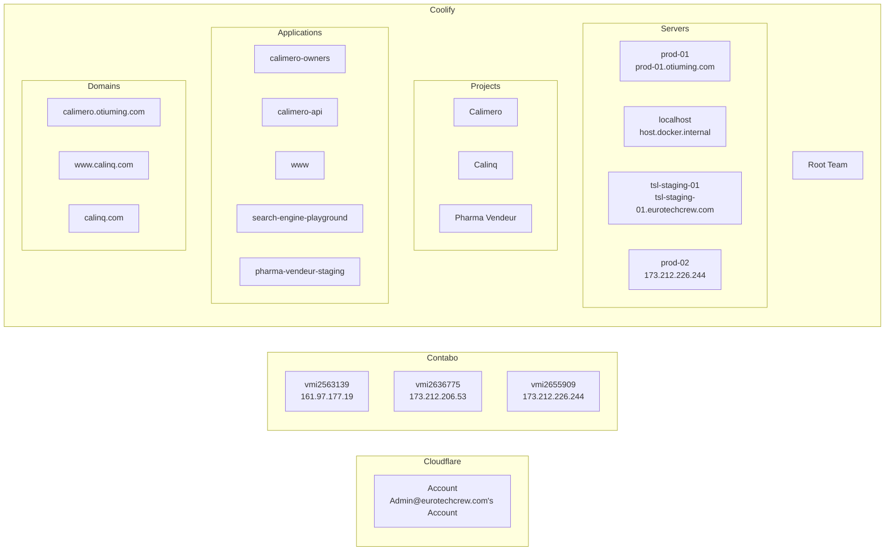
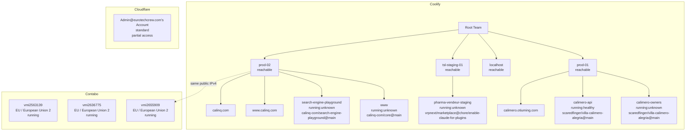
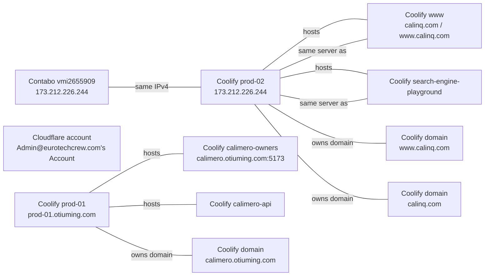

# Infrastructure Graphs

This document visualizes the currently committed, directly observed infrastructure inventory.
It is intentionally incomplete where provider access is partial or unavailable.
It is maintained as a derived view under `docs/decisions/00007-infrastructure-derived-correlation-graph-view.md` and should be updated with inventory changes.

## Level 0: Provider Overview

## Level 1: Provider Breakdown

## Level 2: Observed Relationships

## Correlations

### Strong correlations

- `Coolify prod-02` and `Contabo vmi2655909` share the exact IPv4 `173.212.226.244`.
- `Coolify prod-01` hosts both `calimero-owners` and `calimero-api`.
- `Coolify prod-02` hosts both `www` and `search-engine-playground`.
- `Coolify tsl-staging-01` hosts `pharma-vendeur-staging`.
- `calimero.otiuming.com` is tied to `prod-01` and `calimero-owners`.
- `calinq.com` and `www.calinq.com` are tied to `prod-02` and `www`.

### Structural correlations

- `calimero-owners` and `calimero-api` share the same repo and branch: `scaredfinger/villa-calimero-alegria@main`.
- `www` and `search-engine-playground` both belong to the `calinq` naming family and run on `prod-02`.
- `pharma-vendeur-staging` shares the `pharma-vendeur` naming family with the `Pharma Vendeur` Coolify project.
- `Cloudflare` is currently only correlated at the account level; no verified zone or workers relationships are present.
- `Contabo` instances are currently unlinked to the Coolify inventory except for the shared IP match above.

## Notes

- Only directly observed resources are shown.
- Cloudflare is partial: account-level reads worked, but deeper access failed during probing.
- Contabo is modeled from the direct API script output, not the MCP path.
- Coolify resources are the primary inventory source in the current repository snapshot.
